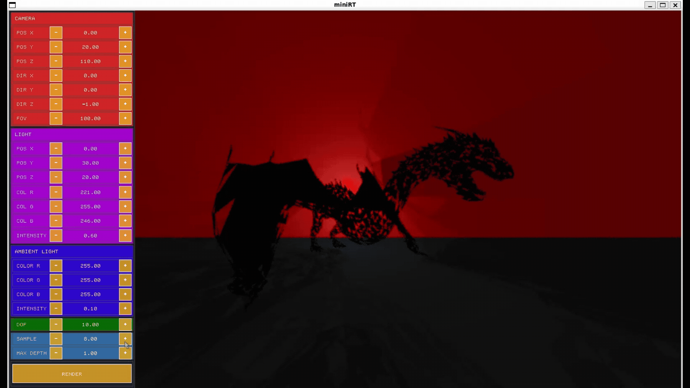

<div align="center">

# 🎨 MiniRT - Advanced Ray Tracer with Interactive UI

[](https://42.fr)
[](LICENSE)
[](https://github.com/codam-coding-college/MLX42)

</div>

---

## 📋 Table of Contents
- [Overview](#-overview)
- [Demo](#-demo)
- [Features](#-features)
  - [Mandatory Requirements](#-mandatory-requirements)
  - [Bonus Features](#-bonus-features)
  - [Advanced Features](#-advanced-features)
- [🏗️ Architecture](#-architecture)
- [🛠️ Installation](#-installation)
- [🚀 Usage](#-usage)
- [📝 Scene File Format](#-scene-file-format)
- [📚 Examples](#-examples)
- [🐛 Troubleshooting](#-troubleshooting)
- [👥 Team](#-team)

## 🚀 Overview
MiniRT is a feature-rich ray tracing engine that extends beyond the 42 curriculum requirements. Built with MLX42, it offers an interactive interface for real-time 3D scene manipulation and rendering. The project demonstrates advanced computer graphics concepts while maintaining excellent performance through optimization techniques.

## 🎥 Demo

### Interactive Demo
<div align="center">
  
  <p><em>Interactive Perlin noise visualization with real-time parameter controls</em></p>
</div>

### Mandatory Scene Demo
<div align="center">
    
  <p><em>Mandatory scene demonstration showing basic primitives and lighting</em></p>
</div>

### Sample and Depth Visualization
<div align="center">
    
    <p><em>Sample and depth visualization showing the scene's depth buffer</em></p>
</div>

### Bonus Scene Demo
<div align="center">
    
    <p><em>Bonus scene demonstration showing advanced features and materials</em></p>
</div>

## ✨ Features

### ✅ Mandatory Requirements

#### Core Functionality
- **Geometric Primitives**:
  - Sphere, Plane, and Cylinder with proper intersection handling
  - Support for object resizing (diameter, width, height)
  - Translation and rotation transformations (except for spheres)
  
- **Lighting System**:
  - Ambient lighting
  - Point lights with configurable brightness
  - Hard shadows
  - Diffuse lighting

- **Rendering**:
  - Real-time window management using MLX42
  - Proper cleanup on window close (ESC or window close button)
  - Scene description via `.rt` configuration files

### 🎁 Bonus Features

#### Enhanced Lighting & Materials
- Full Phong reflection model (ambient, diffuse, specular)
- Colored and multi-spot lights
- Texture support (checkerboard, bump maps)

#### Additional Geometry
- Cone primitive (second-degree object)
- Triangle primitive

### 🚀 Advanced Features

#### Performance
- Multi-threaded rendering
- BVH acceleration
- AABB optimization
- Custom memory management

#### Visual Effects
- Depth of Field (DoF)
- Perlin noise generation
- Advanced materials (metal, glass)
- Procedural textures

#### Scene Management
- OBJ file import
- Complex scene handling
- Resource management

## 🏗️ Architecture

### Core Components
- **Ray Tracing Engine**
  - Multi-threaded rendering using work queues
  - Bounding Volume Hierarchy (BVH) for accelerated ray-object intersection
  - Axis-Aligned Bounding Boxes (AABB) for efficient spatial partitioning
  - Custom memory allocator for improved performance

### Material System
- **Material Types**
  - Phong reflection model (ambient, diffuse, specular)
  - Physically-based rendering (PBR) materials
  - Support for metal and glass materials
  - Texture mapping with UV coordinates
  - Normal/Bump mapping for surface detail

### Geometry Pipeline
- **Primitive Support**
  - Sphere, Plane, Cylinder (mandatory)
  - Cone, Triangle (bonus)
  - OBJ mesh import
  - Smooth shading and normal interpolation

### Rendering Pipeline
- **Ray Tracing**
  - Multi-threaded rendering using work queues
  - Bounding Volume Hierarchy (BVH) for accelerated ray-object intersection
  - Axis-Aligned Bounding Boxes (AABB) for efficient spatial partitioning
  - Custom memory allocator for improved performance

### UI System
- **Immediate Mode UI**
  - Real-time parameter adjustment
  - Interactive debugging tools
  - Loading screen with progress indication

## 🛠️ Installation

### Prerequisites
- GCC or Clang
- Make
- MLX42 graphics library
- libft (included)

### Compilation

# Clone the repository
git clone [your-repository-url]
cd miniRT

### Build Options
- `make` - High quality (64 samples, depth 8)
- `make low` - Fast preview (2 samples, depth 1)
- `make debug` - Debug build with verbose output

## 🚀 Usage

### Running the Application
```bash
# Build the project
make

# Run with a scene file
./miniRT assets/mandatory/spheres.rt

# Run interactive Perlin noise visualization (no scene file needed)
./miniRT
```

### Controls
- `ESC` or close window: Exit the application
- `+/-`: click +/- button to increment and decrement values
- `Render`: click render button to render the scene

### Perlin Noise Controls (when running without a scene file)
- `↑/↓ Arrow Keys`: Move between parameters
- `←/→ Arrow Keys`: Decrement/Increment selected parameter
- `1, 2, 3, 4`: Change Perlin noise type

## 📝 Scene File Format

### Basic Elements
```
# Camera (position, direction, FOV, [aperture], [focus_distance])
# Example with depth of field:
C 0,0,20 0,0,1 80 ap:0.2 fc:3

# Ambient light (ratio, color)
A 0.2 255,255,255

# Light (position, brightness, color)
L 9,10,-3 0.75 255,255,255
```

### Primitives
```
# Sphere (position, diameter, color, [material])
sp 45,0,0 3.0 200,150,255 m_glass

# Plane (position, normal, color, [material])
pl -10,0,0 1,0,0 255,255,255 m_wall

# Cylinder (position, axis, diameter, height, color, [material])
cy 15,0,20 0,1,0 5 10 255,255,0

# Cone (position, axis, diameter, height, color, [material])
co 0,0,0 0,1,0 2 5 255,0,0 m_metal

# Triangle (3 points, color, [material])
tr 0,0,0 1,0,0 0,1,0 255,0,0

# Imported OBJ (position, rotation, scale, color, obj_file, [material])
obj 0,0,0 0,1,0 1.0 255,0,0 asset/models/wolf.obj m_wolf
```

### Material System
Materials are defined with the `m_` prefix and can be referenced by primitives.

#### Basic Syntax
```
# m_<name> type:<lambertian|metal|dielectric> [parameters...]

# Example materials
m_metal   type:metal     fuz:0.1  alb:200,200,200
m_glass   type:dielectric ir:1.5  tr:0.99
m_lambert type:lambertian alb:255,0,0
```

#### Material Parameters
- `fuz:<float>` - Fuzziness (0-1, for metal materials)
- `shi:<float>` - Shininess/specular exponent
- `spc:<float>` - Specular intensity (0-1)
- `ir:<float>` - Index of refraction (for dielectric)
- `tr:<float>` - Transparency (0-1)
- `alb:<R,G,B>` - Albedo color (0-255 for each channel)
- `col:<R,G,B>` - Alternative color parameter

### Textures
Textures can be applied to materials using the following parameters:

#### Texture Types
```
# Pattern types
pat:solid     # Solid color (default)
pat:checker   # Checkerboard pattern
pat:image     # Image texture
pat:pink      # Pink noise
pat:wood      # Wood grain
pat:marble    # Marble pattern
pat:turb      # Turbulence noise
```

#### Texture Properties
```
tex:path.png     # Path to texture image
su:1.0          # U scale (tiling)
sv:1.0          # V scale (tiling)
off:x,y         # Texture offset
rot:45          # Rotation in degrees
```

#### Perlin Noise Parameters (for procedural textures)
```
p_rate:4.0     # Noise frequency
p_gain:0.5     # Persistence (0-1)
p_freq:0.2     # Base frequency
p_ampt:1.0     # Amplitude
p_layers:4     # Octaves
p_scale:1.0    # Overall scale
p_dist:1.0     # Distance between noise points
```

#### Bump Mapping
```
bump:path.png         # Path to bump map
bump_scale:0.1       # Bump map intensity
bump_pat:wood        # Procedural bump pattern
```

### Complete Material Examples
```
# Wood material with bump mapping
m_wood type:lambertian spc:1.0 shi:200.0 pat:wood su:32 sv:16 col:87,37,37 \
  p_rate:4.0 p_gain:0.016 p_freq:0.266 p_ampt:6.141 \
  bump_pat:wood bump_scale:0.02

# Earth material with texture and bump map
m_earth type:lambertian spc:1.0 shi:100.0 l_rough:0.2 \
  pat:image tex:asset/textures/earth.png \
  bump:asset/textures/earth_bump.png bump_scale:70.0
```

## 📚 Examples

### Mandatory Scenes
```bash
# Basic scene with spheres
./miniRT assets/mandatory/spheres.rt

# Scene with multiple primitives
./miniRT assets/mandatory/many_objects.rt
```

### Bonus Scenes
```bash
# Complex scene with advanced features
./miniRT assets/bonus/ocean.rt
```

## 🐛 Troubleshooting

### Performance Optimization
If you experience slow rendering, try these optimizations:
- Use the low-quality preset for faster previews:
  ```bash
  make low
  ./miniRT scene.rt
  ```
- Reduce the number of objects in complex scenes
- Lower the maximum ray depth in the scene configuration

## 👥 Team

This project was developed in collaboration with [Jose](https://github.com/JoseJBoon).


## 🙏 Acknowledgments

- [MLX42](https://github.com/codam-coding-college/MLX42) - Graphics library

---

<div align="center">
  <sub>Built with ❤️ at 42 | 2025</sub>
</div>
